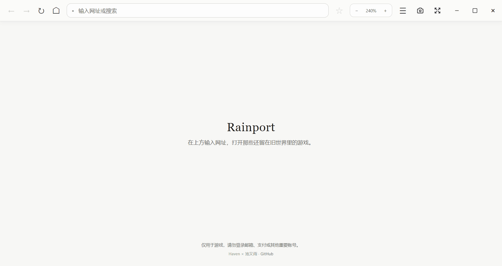
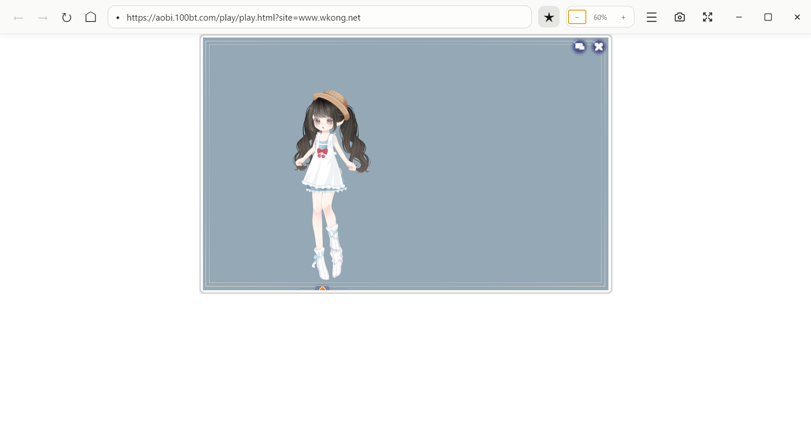
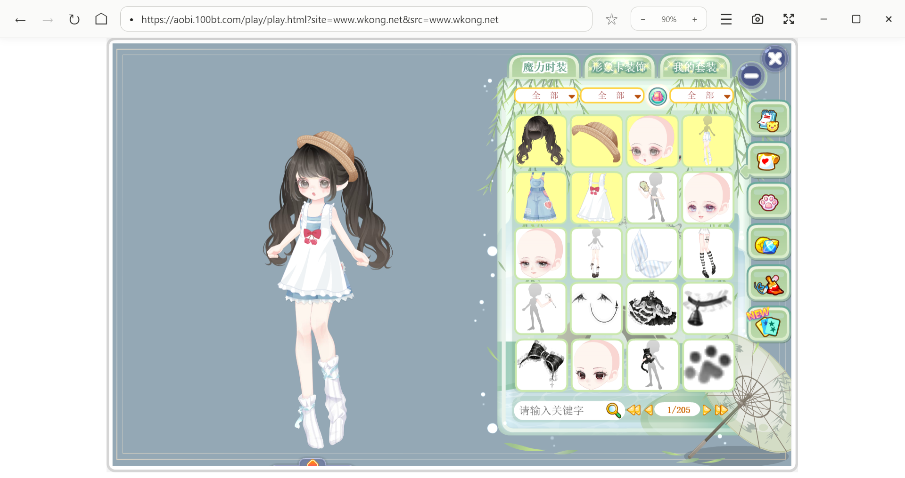
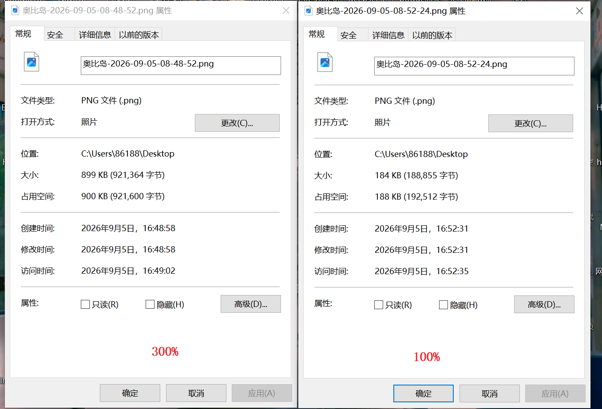

# Rainport

> A small Windows browser for the Flash games left behind by time.

Rainport 是一个专门用来运行旧 Flash 页游的轻量浏览器壳。它基于 Electron 11、
Chromium 87 和 PPAPI Flash Player 29，提供基础页面缩放、收藏夹和历史记录；针对百田
游戏另外提供直达页识别、游戏容器全屏和完整画面截图。

## 下载

从 [GitHub Releases](https://github.com/Yinglianchun/rainport-flash/releases/latest) 下载 Windows x64
压缩包，完整解压后运行 `Rainport.exe`。不要直接在 ZIP 内启动，也不要只取出 exe。

## 游戏兼容

Rainport 可以运行网页中的 Flash 游戏，包括百田的奥比岛、奥雅之光、奥奇传说、奥拉星、
龙斗士，以及腾讯、淘米、4399 等站点的 Flash 游戏。只要游戏页面与服务器仍可访问，
基础 Flash 播放就不局限于某一家平台。

目前仅直达页识别、游戏容器全屏和完整游戏画面截图属于百田游戏专项功能；其他站点仍可
正常游玩，但不保证能够识别并单独处理游戏框。

在单独打开一个游戏的实际体验中，Rainport 比百田游戏管家更轻、更流畅；它没有游戏管家
外围的推荐、活动和管理界面，只保留游戏需要的浏览器壳。

## 百田游戏专项功能

- **直达页识别**：打开游戏官网后，Rainport 会尝试识别是否存在只承载游戏的直达页。
  找到后会询问是否跳转，可以进入直达页，也可以留在官网。
- **游戏容器全屏**：针对已识别的百田游戏，裁出并居中游戏区域，隐藏官网导航、广告和周围页面。
- **完整游戏截图**：针对已识别的百田游戏，无论是否跳转直达页，截图都只包含完整游戏画面，不包含工具栏，
  也不会截到游戏框以外的页面。
- **按缩放比例截图**：百田游戏截图使用当前缩放比例。即使 300% 的游戏画面超出显示器可见范围，
  仍会扩展渲染区域后截取完整游戏框，再恢复原来的窗口。

### 直达页

奥比岛直达页比官网少了大量外围内容。Rainport 从官网识别到它时会先询问，不会强制跳转。

### 百田游戏全屏

全屏模式只保留并居中游戏容器，周围使用白色留白。

### 百田游戏的 100% 与 300% 完整截图

100% 游戏画面：

在 300% 缩放下，Rainport 会按照当前比例扩展游戏的实际渲染尺寸，并截取整个游戏框：

同一画面的示例中，300% 截图约为 899 KB，100% 截图约为 184 KB：

继续放大 300% 截图观察，人物线条仍然清晰，不是把屏幕上的可见小块简单拉伸：

## 安全提示

Rainport 使用已经停止维护的浏览器内核与 Flash Player，只应用于旧游戏。
请勿用它登录邮箱、支付平台、网银或其他重要账号。

## 运行方式

仓库只包含 Rainport 自身的源码和图标，不包含 Electron/Chromium 运行时，也不包含
Adobe Flash Player。运行时需要自行准备：

1. 准备 Electron 11 的 Windows 运行目录。
2. 将本仓库文件放入运行目录的 `resources/app`。
3. 将兼容的 64 位 PPAPI Flash 插件放到 `resources/libs/pepflashplayer64.dll`。
4. 启动 Electron 可执行文件。

已完成打包的版本直接运行 `Rainport.exe` 即可。

## 快捷键

- `Ctrl+L`：聚焦地址栏
- `Ctrl+R`：刷新
- `Ctrl++` / `Ctrl+-` / `Ctrl+0`：页面缩放
- `Ctrl+Shift+S`：截取完整百田游戏画面
- `Alt+Left` / `Alt+Right`：前进后退
- `F11`：百田游戏容器全屏

## 数据

为保留更名前已有的游戏登录状态，当前版本继续使用原有的本地用户数据目录和
`persist:haven-flash` 分区。收藏夹、历史记录和缩放设置也沿用旧键名。

## Authors

Haven × 池又雨
